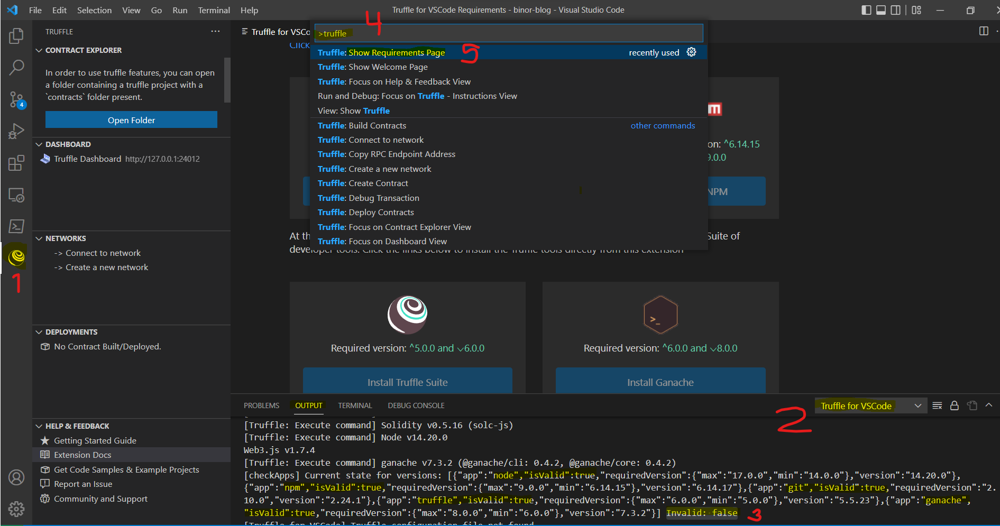

## Intro

**Truffle for VSCode** is a VSCode extention giving you easy access to evm development tools



1. Selecting the `Truffle explorer` gives you access to ...
2. Output window `Truffle for VSCode`, which tells you status of your development environment
3. If status is `Invalid: false` then all your tools are ok
4. In `Command Palette` you can also choose ...
5. `Show Requirement page` to get a UI page also giving your status of all your tools

## Install

The Truffle for VSCode extension is running on or using a list of tools:  
python, msbuild, node/npm, git, truffle and ganache.  

The current list of minimum versions are here:

* [Prerequisites](https://trufflesuite.com/docs/vscode-ext/installation-guide/):
    * [Python](https://www.python.org/downloads/) (3.x.x) (`py --version`) - needed for [node-gyp](./node-gyp-install) 
    * [VS Build Tools 2022](https://visualstudio.microsoft.com/thank-you-downloading-visual-studio/?sku=BuildTools&WT.mc_id=dotnet-50103-juyoo&ocid=AID3035186) - also for node-gyp
    * node (14.0.0) (`node -v`)
    * npm (6.14.15) (`npm -v`)
    * git (2.10.0) (`git --version`)
    * Truffle Suite (5.0.0) (`truffle help`)
    * Ganache (6.0.0) (`ganache --version`)
* VSCode extension: [Truffle for VS Code](https://marketplace.visualstudio.com/items?itemName=trufflesuite-csi.truffle-vscode)

When you have installed the usual suspects, python, msbuild, node/npm, git, 
then install Truffel and Ganache globally:

```bash
npm i -g truffle
npm i -g ganache
```

ganache might give you errors like:
```bash
# npm ERR! command C:\WINDOWS\system32\cmd.exe /d /s /c node-gyp-build
# npm ERR! 'node-gyp-build' is not recognized as an internal or external command,
# npm ERR! operable program or batch file.
```
If so then [troubleshoot node-gyp here](./node-gyp-install).

I am running on:

* Windows 11 home
* python 3.10.5
* nvm 1.1.7 (node version manager)
* node [14.20.0](https://nodejs.org/en/download/releases/)
* npm 6.14.17
* git 2.24.1
* truffle 5.5.23
* ganache 7.3.2

## Links

* Blog: [Truffle 4 VSCode extension](https://trufflesuite.com/blog/build-on-web3-with-truffle-vs-code-extension/)
    * Get [VSCode extension](https://marketplace.visualstudio.com/items?itemName=trufflesuite-csi.truffle-vscode)
    * [Docs/Usage](https://trufflesuite.com/docs/vscode-ext/)

...
