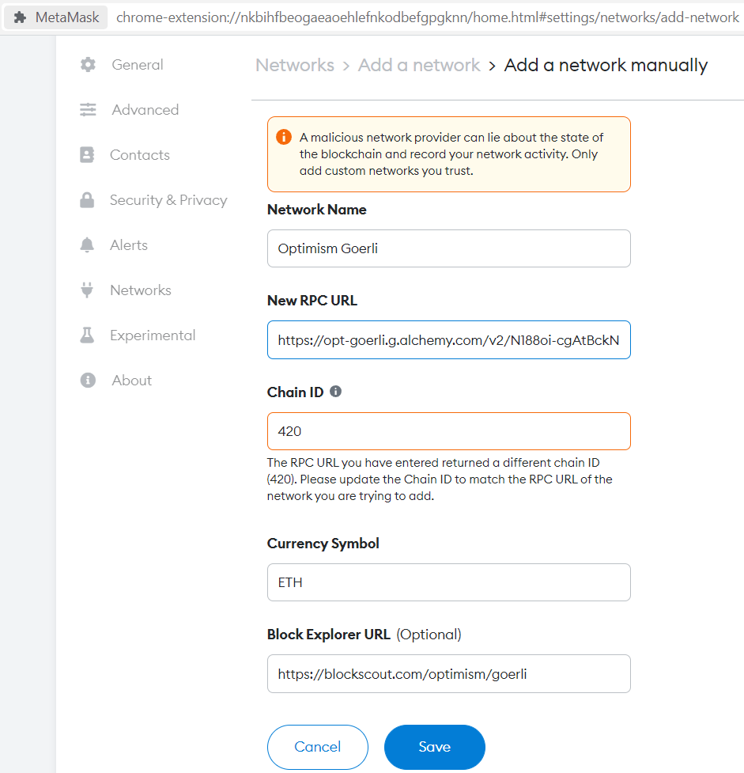
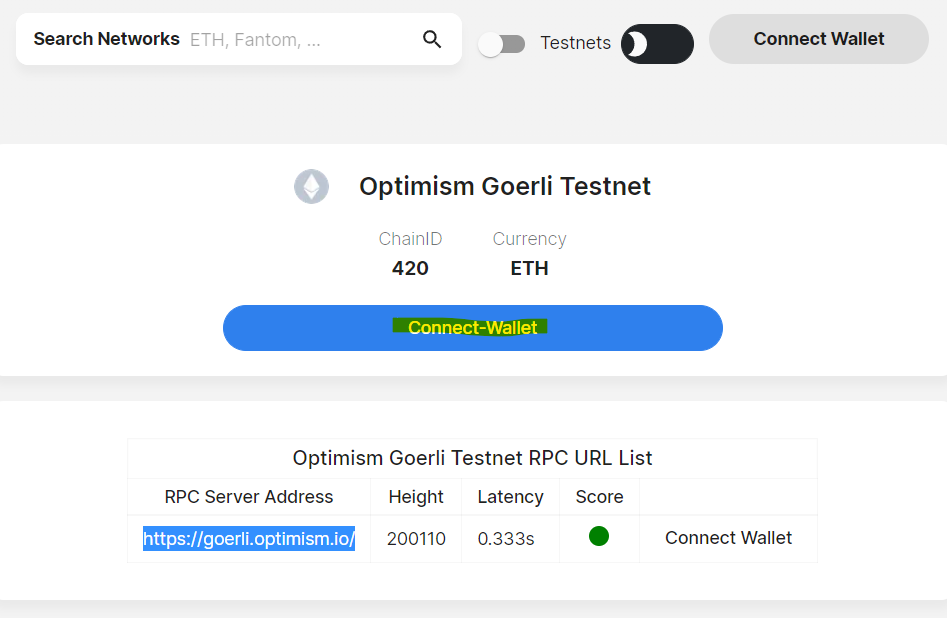
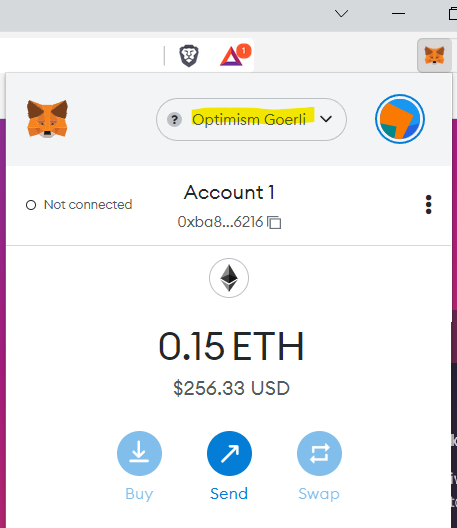

### Intro

How do you get funds on Optimism testnet?  
Here is howto get them on Optimism Goerli network.  
I'll be using a node provider opposing to setting up a node myself.    

Web3 test- and prod nodes are some we could run ourselves, but in this blog I'll use 3rd-party hosted nodes.  
As info see some offerings of [Infura, Kaleido, Optimism and Polygon (Matic)](https://sourceforge.net/software/compare/Infura-vs-Kaleido-vs-Optimism-vs-Polygon-Matic/).  

### Install

Install [MetaMask Wallet](https://metamask.io/download/) - choose browser extension

### SaaS

Alchemy and Infura are two examples of node-as-a-service providers.  
If you create DApps your node provider could limit the number of RPC calls.  
In that case you will often want an account at the node provider, so sign up for an account at:

* [Infura](https://infura.io) - choose Web3/ETH1 network. Project Name: nft-marketplace.  
    Infura gives trial (30 days) access to L2 chains, but on ETH you can use `Gorli`.
* [Alchemy](https://www.alchemy.com) -  choose ETH then Optimism Gorli network. Project Name: nft-marketplace-optimism.
* Other Optimism node providers:
    * [Providers 1](https://github.com/ethereum-optimism/optimism-tutorial/tree/main/getting-started#optimism-endpoint-url)
    * [Providers 2](https://community.optimism.io/docs/useful-tools/providers)

Note: The projects I'll use in another blog. You can skip this SaaS section and goto `Automatic add network`, if you don't need a node provider.  

### Funds

To fund your MetaMask browser wallet you need a twitter account with at least 1 Tweet, 15 followers, and be older than 1 month.  
When you have that you can drip your wallet from [Paradigm MultiFaucet](https://faucet.paradigm.xyz) on lots of test networks.  

Another [Ethereum Goerli Faucet](https://goerlifaucet.com) requires you to have an [Alchemy](https://www.alchemy.com) account.  
When you have received your `Ethereum Goerli` you can transfer som to [Address 0x636Af16bf2f682dD3109e60102b8E1A089FedAa8](https://goerli.etherscan.io/address/0x636Af16bf2f682dD3109e60102b8E1A089FedAa8). This will transfer ETH to your account on `Optimism Goerli`.  

Optimism is supported by a range of [wallets](https://www.optimism.io/apps/wallets)

#### Adding Optimism-Goerli to Metamask

When you have 

* your node provider up (e.g. on Alchemy or Infura) and
* transferred goerli ETH to optimism-goerli

then you want to see your money in Metamask.  
  
##### Manually add network

So in metamask press [add network](chrome-extension://nkbihfbeogaeaoehlefnkodbefgpgknn/home.html#settings/networks/add-network)
  
Then add `Optimism Goerli Testnet network details` from [Chainlist](https://chainlist.org/chain/420) or from [Optimism](https://community.optimism.io/docs/useful-tools/networks/#optimism-goerli)
  

As you can see I have used my Alchemy RPC url, but you can use `https://goerli.optimism.io`, too.  
  
##### Automatic add network

Instead you could have just pressed `Connect Wallet` on [Chainlist - Optimism Goerli Testnet](https://chainlist.org/chain/420)

In metamask I can now see the funds I transferred

...
