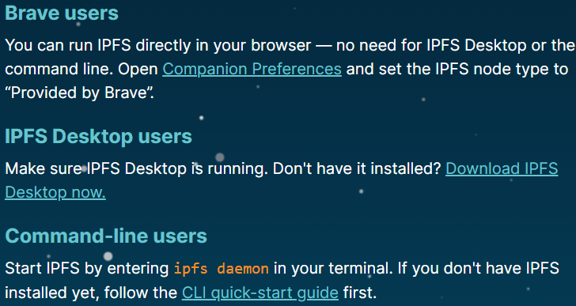
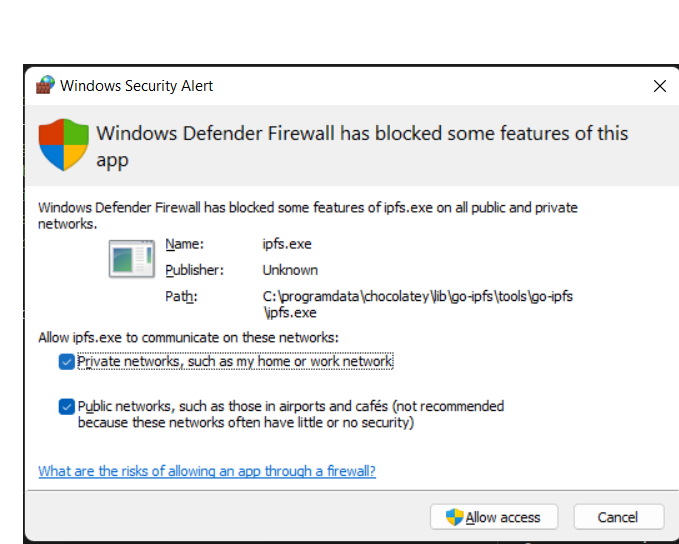
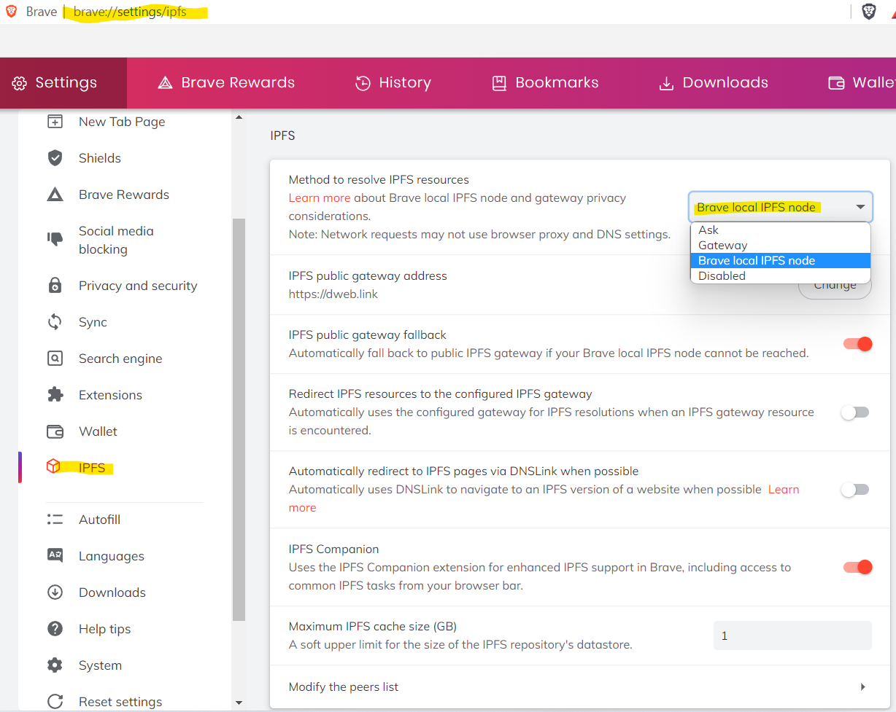
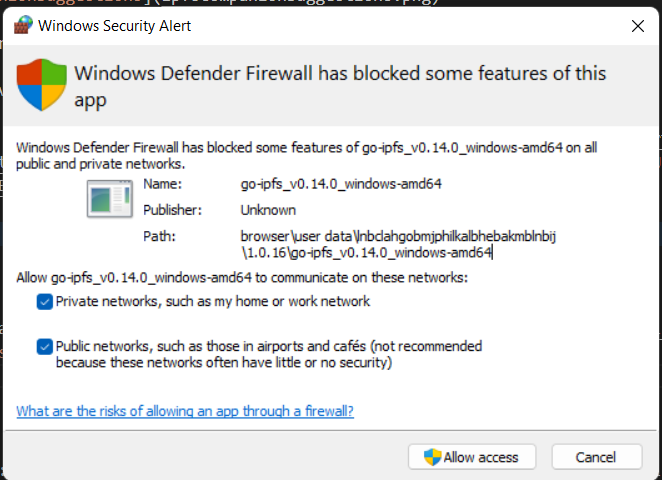
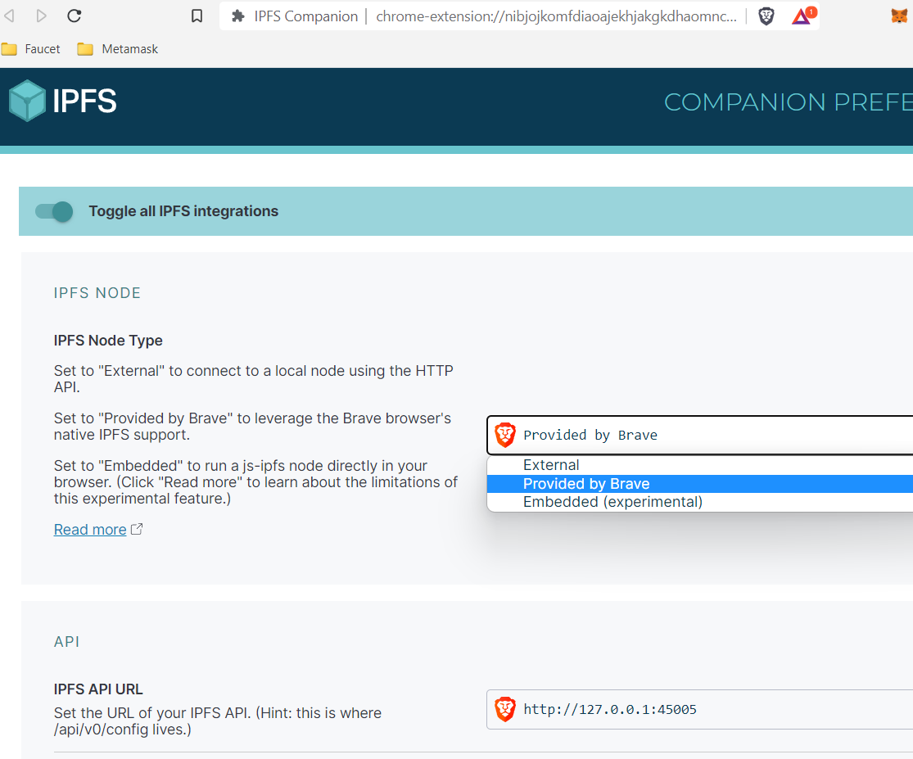

### Intro

For IPFS development it can be nice to have your own node running.  
The browser extension [IPFS Companion](https://chrome.google.com/webstore/detail/ipfs-companion/nibjojkomfdiaoajekhjakgkdhaomnch) suggests 3 ways:  


I am here trying out two of them:
1. IPFS node provided by CLI and
2. IPFS node Provided by Brave browser 

For 1. I am following along [Davi Pedro Bauer's](https://www.amazon.com/Get-Started-Ethereum-Step-Step/dp/B098GY3XDN/ref=sr_1_2?keywords=Get+Started+with+Ethereum&qid=1660209122&sr=8-2) vid [HOW TO CREATE YOUR IPFS NODE](https://www.youtube.com/watch?v=dFWpGn73BBM) to get a node up running.

### Alt. 1. Installing a local ipfs node

Prerequisites for this instruction:
* Windows 11 Home
* [Chocolatey](https://chocolatey.org/install)

I am running:
```bash
# cmd:
systeminfo | findstr /B /C:"OS Name" /C:"OS Version"
# OS Name:                   Microsoft Windows 11 Home
# OS Version:                10.0.22000 N/A Build 22000
choco -v
# 0.10.15
```

From terminal 1 - run-as-admin
```bash
# bash1 (as admin):
choco install ipfs
# Installing the following packages:
# ipfs

# go-ipfs v0.13.1 [Approved]
# go-ipfs package files install completed. Performing other installation steps.
# The package go-ipfs wants to run 'chocolateyinstall.ps1'.
# Do you want to run the script?([Y]es/[A]ll - yes to all/[N]o/[P]rint): y
# C:\ProgramData\chocolatey\lib\go-ipfs\tools
#  ShimGen has successfully created a shim for ipfs.exe
#  The install of go-ipfs was successful.
#   Software installed to 'C:\ProgramData\chocolatey\lib\go-ipfs\tools'

# ipfs v0.9.0 [Approved]
# ipfs package files install completed. Performing other installation steps.
#  The install of ipfs was successful.
#   Software install location not explicitly set, could be in package or
#   default install location if installer.

# Chocolatey installed 2/2 packages.
#  See the log for details (C:\ProgramData\chocolatey\logs\chocolatey.log).

ipfs --version
# ipfs version 0.13.1
```

Close the admin terminal and open a normal one.  
Lets see what's in the box
```bash
# bash2:
ipfs --help
# USAGE
#   ipfs  - Global p2p merkle-dag filesystem.

# SYNOPSIS
#   ipfs [--config=<config> | -c] [--debug | -D] [--help] [-h] [--api=<api>] [--offline] [--cid-base=<base>] [--upgrade-cidv0-in-output] [--encoding=<encoding> | --enc] [--timeout=<timeout>] <command> ...

# OPTIONS
#   --repo-dir                 string - Path to the repository directory to use.
#   --config-file              string - Path to the configuration file to use.
#   -c, --config               string - [DEPRECATED] Path to the configuration file to use.
#   -D, --debug                bool   - Operate in debug mode.
#   --help                     bool   - Show the full command help text.
#   -h                         bool   - Show a short version of the command help text.
#   -L, --local                bool   - Run the command locally, instead of using the daemon. DEPRECATED: use --offline.
#   --offline                  bool   - Run the command offline.
#   --api                      string - Use a specific API instance (defaults to /ip4/127.0.0.1/tcp/5001).
#   --cid-base                 string - Multibase encoding used for version 1 CIDs in output.
#   --upgrade-cidv0-in-output  bool   - Upgrade version 0 to version 1 CIDs in output.
#   --enc, --encoding          string - The encoding type the output should be encoded with (json, xml, or text). Default: text.
#   --stream-channels          bool   - Stream channel output.
#   --timeout                  string - Set a global timeout on the command.

# SUBCOMMANDS
#   BASIC COMMANDS
#     init          Initialize local IPFS configuration
#     add <path>    Add a file to IPFS
#     cat <ref>     Show IPFS object data
#     get <ref>     Download IPFS objects
#     ls <ref>      List links from an object
#     refs <ref>    List hashes of links from an object

#   DATA STRUCTURE COMMANDS
#     dag           Interact with IPLD DAG nodes
#     files         Interact with files as if they were a unix filesystem
#     block         Interact with raw blocks in the datastore

#   TEXT ENCODING COMMANDS
#     cid           Convert and discover properties of CIDs
#     multibase     Encode and decode data with Multibase format

#   ADVANCED COMMANDS
#     daemon        Start a long-running daemon process
#     resolve       Resolve any type of content path
#     name          Publish and resolve IPNS names
#     key           Create and list IPNS name keypairs
#     pin           Pin objects to local storage
#     repo          Manipulate the IPFS repository
#     stats         Various operational stats
#     p2p           Libp2p stream mounting (experimental)
#     filestore     Manage the filestore (experimental)
#     mount         Mount an IPFS read-only mount point (experimental)

#   NETWORK COMMANDS
#     id            Show info about IPFS peers
#     bootstrap     Add or remove bootstrap peers
#     swarm         Manage connections to the p2p network
#     dht           Query the DHT for values or peers
#     ping          Measure the latency of a connection
#     bitswap       Inspect bitswap state
#     pubsub        Send and receive messages via pubsub

#   TOOL COMMANDS
#     config        Manage configuration

#   0     Successful execution.
#   1     Failed executions.

#   For more information about each command, use:
#   'ipfs <subcmd> --help'
```

Ipfs will place config in`~/.ipfs`, when you initialize it
```bash
# bash2:
# init a node
ipfs init
# generating ED25519 keypair...done
# peer identity: 12D3KooWMj795A8avvL6vSJED54cAMgbguUBbP2hgzkTt7F6yPoZ
# initializing IPFS node at ~\.ipfs
# to get started, enter:
#         ipfs cat /ipfs/QmQPeNsJPyVWPFDVHb77w8G42Fvo15z4bG2X8D2GhfbSXc/readme
```

Run Ipfs from a 3rd terminal
```bash
# bash3:
ipfs daemon
# Initializing daemon...
# go-ipfs version: 0.13.1
# Repo version: 12
# System version: amd64/windows
# Golang version: go1.18.3
# Swarm listening on /ip4/127.0.0.1/tcp/4001
# Swarm listening on /ip4/127.0.0.1/udp/4001/quic
# Swarm announcing /ip4/127.0.0.1/tcp/4001
# Swarm announcing /ip4/127.0.0.1/udp/4001/quic
# API server listening on /ip4/127.0.0.1/tcp/5001
# WebUI: http://127.0.0.1:5001/webui
# Gateway (readonly) server listening on /ip4/127.0.0.1/tcp/8080
# Daemon is ready
```
When starting the node Windows defender firewall wants to open some ports, so the node can communicate  


Back in Terminal 2 we can verify the node is running by printing some files inside it:
```bash
# bash2:
ipfs cat QmQPeNsJPyVWPFDVHb77w8G42Fvo15z4bG2X8D2GhfbSXc/readme
# Hello and Welcome to IPFS!

# ██╗██████╗ ███████╗███████╗
# ██║██╔══██╗██╔════╝██╔════╝
# ██║██████╔╝█████╗  ███████╗
# ██║██╔═══╝ ██╔══╝  ╚════██║

# Check out some of the other files in this directory:

#   ./about
#   ./help
#   ./quick-start     <-- usage examples
#   ./readme          <-- this file
#   ./security-notes
```
We are now in network with a lot of other nodes...
```bash
# bash2:
ipfs swarm peers
# /ip4/1.189.89.123/udp/64983/quic/p2p/12D3KooWNvABmtNVz3Q3ayBQLZHxWxnxePKXyHPqP6ww1gyje6Kb
# /ip4/1.82.128.241/udp/31361/quic/p2p/12D3KooWFcUaG8sWjJd4BSWij37mSJeyYXuTtGcEBevU8nr81roM
# around 60 other peers....
```
So if you ctrl-c terminal 3 and restart it in offline mode
```bash
# bash3
ipfs daemon --offline
# Initializing daemon...
# Swarm not listening, running in offline mode.
# API server listening on /ip4/127.0.0.1/tcp/5001
# WebUI: http://127.0.0.1:5001/webui        
# Gateway (readonly) server listening on /ip4/127.0.0.1/tcp/8080
# Daemon is ready
```
Then you can still access the node, but it will not be in a network
```bash
# bash2
ipfs swarm peers
# Error: this action must be run in online mode, try running 'ipfs daemon' first

# And WebUI will also complain
start http://127.0.0.1:5001/webui
```

### Alt. 2. Using Brave browser build-in ipfs node

When using a Brave browser you'll find [IPFS settings here](http://brave://settings/ipfs)

Choose **Brave local IPFS node** and  
[IPFS Companion](http://chrome-extension://nibjojkomfdiaoajekhjakgkdhaomnch/dist/landing-pages/welcome/index.html)

Also Brave IPFS wants holes in the firewall  
  
I am usure when it is detected by windows defender - It took a while before it appeared on my PC.  

With the IPFS Companion you can select which IPFS node you want to query (CLI = [External](https://docs.ipfs.tech/how-to/companion-node-types/#external) or [Brave](https://docs.ipfs.tech/how-to/companion-node-types/#provided-by-brave)) from the browser  
[](http://chrome-extension://nibjojkomfdiaoajekhjakgkdhaomnch/dist/options/options.html)

IPFS Companion will [automatically detect and redirect IPFS resources](https://github.com/ipfs/ipfs-companion#ipfs-companion-features)


### Links

* IPFS Docs: [Command-line quick start](https://docs.ipfs.tech/how-to/command-line-quick-start/)
* Browser extension: [IPFS Companion](http://chrome-extension://nibjojkomfdiaoajekhjakgkdhaomnch/dist/landing-pages/welcome/index.html)
* Local [IPFS Privacy issues](https://support.brave.com/hc/en-us/articles/360051406452-How-does-IPFS-Impact-my-Privacy-)

...
