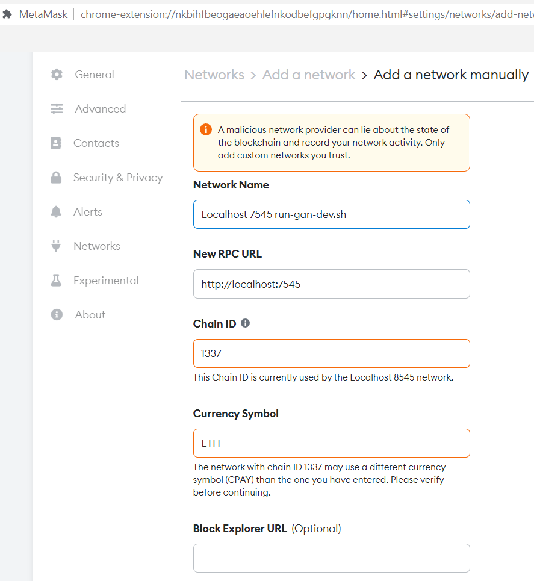
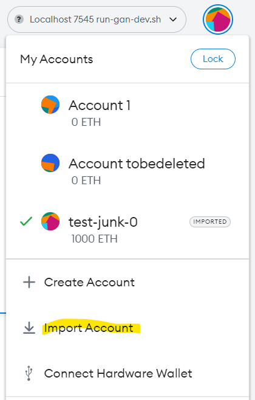
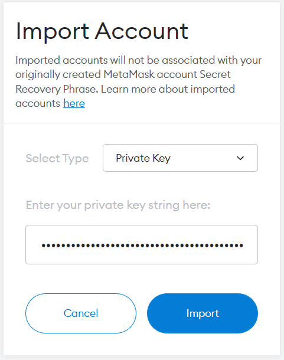
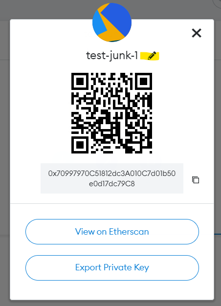
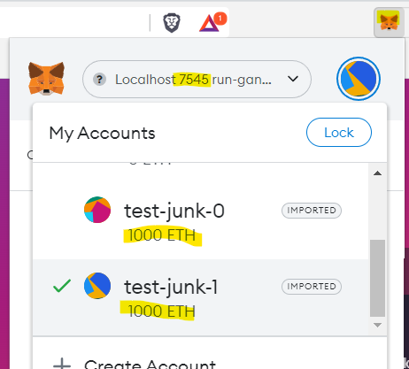
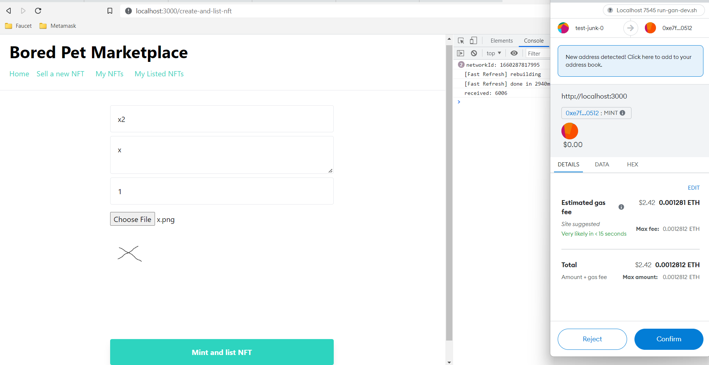
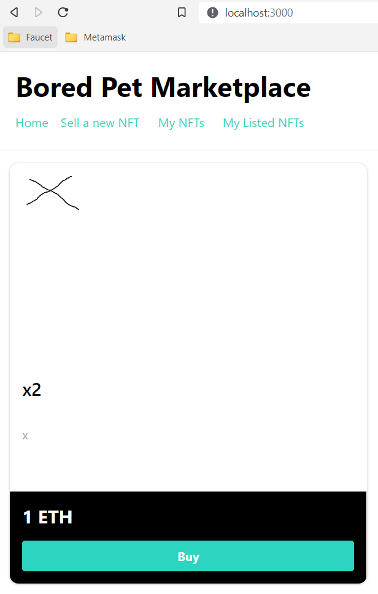
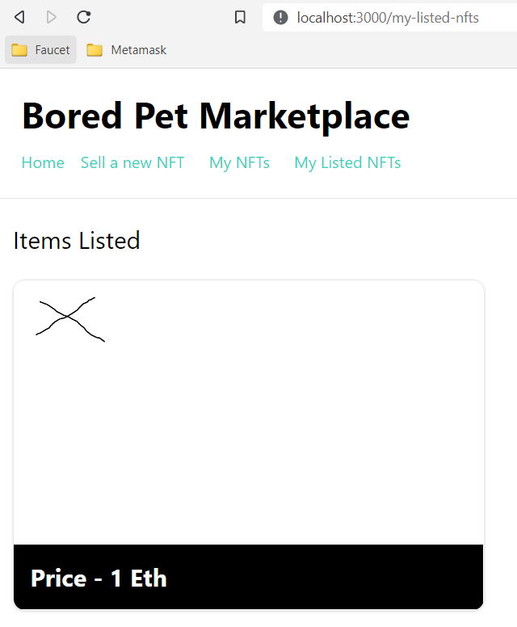
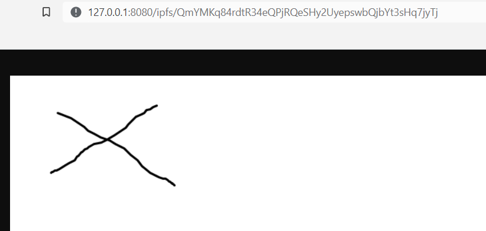

## Intro

This is my replay of the blog [How to Build a NFT Marketplace DApp on Ethereum and Optimism](https://trufflesuite.com/guides/nft-marketplace/) / [vlog](https://youtu.be/Ie1o34Xh1I4)  
by Emily [@_emjlin](https://twitter.com/_emjlin).  

* [Code](https://github.com/truffle-box/nft-marketplace-box) for her project
* Slightly modified [code](https://github.com/binordev/nft-marketplace) (of above) for this blog.  

Opposed to Emily I'll deploy only locally to ganache and a local ipfs and run the web locally. And so far I will only do the evm deploy - not to optimism.  

### @dabit3's code

Emilys code is inspired by [@dabit3](https://twitter.com/dabit3)'s [code](https://github.com/dabit3/polygon-ethereum-nextjs-marketplace/). As Emily he wrote a [blog](https://dev.to/edge-and-node/building-scalable-full-stack-apps-on-ethereum-with-polygon-2cfb) and recorded a [vid](https://www.youtube.com/watch?v=GKJBEEXUha0).  

Opposed to Emily, @dabit3 deploys to Polygon (not Optimism), develops in Hardhat+Hardhat network (not Truffle+[Ganache](https://trufflesuite.com/blog/introducing-ganache-7/)) and uses [ethers](https://www.npmjs.com/package/ethers) (not [web3](https://www.npmjs.com/package/web3)) for [Ethereum JS API](https://www.section.io/engineering-education/web3js-vs-ethersjs/).  
Btw - ethers can be configured to use Ganache instead of Hardhat network.  

@dabit3 has supplied a nice link for deploying the webapp to [Gitpod](https://gitpod.io/#github.com/dabit3/polygon-ethereum-nextjs-marketplace). The [gitpod script](https://github.com/dabit3/polygon-ethereum-nextjs-marketplace/blob/main/.gitpod.yml) also deployes the smart contract before it spins up the webserver.  

### Glossary

This glossary links to networks you might want to connect to

* `EVM` - Ethereum Virtual Machine: A Execution engine that can execute smart contracts on a blockchain
* `Ethereum`: The `L1` blockchain running `EVM` smart contracts
* `NFT`: A unique item on a blockchain enabled via `EVM` contracts
* `IPFS`: A distributed filesystem - like EVM is distributed CPU. Used for storing NFT files and metadata into.  
* `L2`: A faster and cheaper network than the L1 (Ethereum) network on top of the `L1` network
* `Optimism`: An Ethereum `L2` technologi and `test network`
    * [Public RPC Endpoints](https://community.optimism.io/docs/useful-tools/networks/#rpc-endpoints)
* `Infura`: A `production network` supporting `Optimism` 
    * [Choose a network - Infura](https://docs.infura.io/infura/networks/optimism/how-to/choose-a-network)
* `Optimism Goerli`: New test network
    * [wip](https://community.optimism.io/docs/useful-tools/networks/#optimism-goerli)
* `Optimism Kovan`: Old test network
    * [ended august 15th 2022](https://community.optimism.io/docs/useful-tools/networks/#optimism-kovan-old-testnet)
* `Faucet`: Supplier of test ETH to pay for transactions on test networks
    * [Paradigm MultiFaucet](https://faucet.paradigm.xyz)
* `Local development node`: 
    * [Running a local development environment](https://community.optimism.io/docs/developers/build/dev-node/)
    * [optimism-tutorial/getting-started at main · ethereum-optimism/optimism-tutorial](https://github.com/ethereum-optimism/optimism-tutorial/tree/main/getting-started#optimism-endpoint-url)
* `WSL2` Windows Subsystem for Linux: A virtual machine host on Windows (Home)
* `Docker`: A `local virtual machine manager` you can use for hosting `local development node(s)`. On windows Home it will run in `WSL2`

## Install

We need an editor, optional docker ([for optimism box](https://github.com/truffle-box/optimism-box#requirements)) and some web3 tools and a local IPFS node:

* Editor:
    * VSCode
* Optional: docker, version 19.03.12 or later (`docker -v`)
* Optional: docker-compose, version 1.27.3 or later (`docker-compose -v`)
* Web3 Tools (truffle, ganache):
    * [Truffle 4 VSCode Extension](../2022-07-23-truffle-vscode-extension/)
* Web3 Wallet: 
    * [MetaMask](https://metamask.io/download/) - choose browser extension
* Local [IPFS node](../2022-08-11-local-ipfs-on-windows/)

## Development Procedure

### Scaffold your project

In truffle scaffolding/unpacking files are called unboxing.  
For Optimism, there is a pre-defined package you can use:  

```bash
# In bash:
cd <your project-parent-dir>
truffle unbox optimism nft-marketplace
# Unbox successful, sweet!
# Commands:
#   compile: truffle compile
#   migrate: truffle migrate
#   test:    truffle test

# open project in vscode
cd nft-marketplace
code .
```

_[Files](https://github.com/truffle-box/optimism-box) after `truffle unbox optimism`_

### Examining the package

Notice - in `package.json` you find these npm stripts:
```json
  // package.json
  "scripts": {
    "installLocalOptimism": "git clone git@github.com:ethereum-optimism/optimism.git && cd optimism/ops && docker-compose pull",
    "startLocalOptimism": "cd optimism/ops && docker-compose up",
    "stopLocalOptimism": "cd optimism/ops && docker-compose down -v",
    "checkLocalOptimismReady": "cd optimism/ops && scripts/wait-for-sequencer.sh && echo 'System is ready to accept transactions'",
    "compile:evm": "truffle compile",
    "compile:ovm": "truffle compile --config truffle-config.ovm.js",
    "migrate:evm": "truffle migrate",
    "migrate:ovm": "truffle migrate --skip-dry-run --config truffle-config.ovm.js --network $npm_config_network",
    "test:evm": "truffle test",
    "test:ovm": "truffle test --config truffle-config.ovm.js --network $npm_config_network",
    "exec:evm": "truffle exec",
    "exec:ovm": "truffle exec $script --config truffle-config.ovm.js --network $npm_config_network"
  },
```

You see there are 

* `:evm` scripts for running towards `L1 Etherium` and
* `:ovm` scripts for running towards `L2 Optimism`

You see local optimism uses `docker-compose`.  

So what did Emily add?

Now I'll delete the truffle box and install her box

```bash
# In bash:
cd <your project-parent-dir>
rmdir nft-marketplace
truffle unbox nft-marketplace-box nft-marketplace
# open project in vscode
cd nft-marketplace
code .
```

You find the diff in [this commit](https://github.com/binordev/nft-marketplace/commit/191f7a8442d915b073c9b3d8fcab96e44fb67de8)

She added:

* a [next.js webapp](https://github.com/binordev/nft-marketplace/commit/191f7a8442d915b073c9b3d8fcab96e44fb67de8#diff-c4577d0b3a9c55c4e75639bb45f3dd659e83bc31b7a30943fda6ef84f7cef47a)
    * using [tailwind css](https://github.com/binordev/nft-marketplace/commit/191f7a8442d915b073c9b3d8fcab96e44fb67de8#diff-e048fb8380f32b06b874b12ef1f5e1a69acf2f0bbe88b98fe0c91c98ff884952)
* marketplace and nft [smart contracts](https://github.com/binordev/nft-marketplace/commit/191f7a8442d915b073c9b3d8fcab96e44fb67de8#diff-1d4e45b08f1c079108225dc54d333cb784612fdd1d1402fa482a8d55a83bbae0), both for ethereum and optimism
* [deploy script](https://github.com/binordev/nft-marketplace/commit/191f7a8442d915b073c9b3d8fcab96e44fb67de8#diff-5719596698146086876ac469ae9de9400d4956c9c94822d968233c3523306415) for contracts
* she uses kovan instead of goerli [test network](https://github.com/binordev/nft-marketplace/commit/191f7a8442d915b073c9b3d8fcab96e44fb67de8#diff-8f7ceaa83eaf3c53b82b8dc646e61e0d66a865cec9da0baa4c19b9833baacd0f)

### Test run on local ganache

#### Spin up local ganache

If you installed `Truffle 4 VSCode`, then you also intalled `ganache` via npm. If not then revisit Install section.  
Ganache is our localhost blockchain without being in networking with the outer world.  
It will create some funded accounts for us. With one of them you then have funds to pay the gas fee for deploying.  

I have put the ganache cli command in a stript including the mnemonic:

```bash
# scripts/run-gan-dev.sh
# Start ganache on a certain port and with a certain mnemonic
ganache -p 7545 --mnemonic 'test test test test test test test test test test test junk'
```
Notice the usage of non-standard port 7545.  
Reason is that you then can have `ganache` serving EVM on 7545 and `docker optimism` [serving Optimism on standard port 8545](https://community.optimism.io/docs/developers/build/dev-node/#accessing-the-environment).  

Then I start ganache from git-bash  
```bash
# git-bash
./scripts/run-gan-dev.sh
# ganache v7.3.2 (@ganache/cli: 0.4.2, @ganache/core: 0.4.2)
# Starting RPC server

# Available Accounts
# (0) 0xf39Fd6e51aad88F6F4ce6aB8827279cffFb92266 (1000 ETH)
# (1) 0x70997970C51812dc3A010C7d01b50e0d17dc79C8 (1000 ETH)
# (2) 0x3C44CdDdB6a900fa2b585dd299e03d12FA4293BC (1000 ETH)

# Private Keys
# (0) 0xac0974bec39a17e36ba4a6b4d238ff944bacb478cbed5efcae784d7bf4f2ff80
# (1) 0x59c6995e998f97a5a0044966f0945389dc9e86dae88c7a8412f4603b6b78690d
# (2) 0x5de4111afa1a4b94908f83103eb1f1706367c2e68ca870fc3fb9a804cdab365a

# HD Wallet
# ==================
# Mnemonic:      test test test test test test test test test test test junk
# Base HD Path:  m/44'/60'/0'/0/{account_index}

# Chain Id
# ==================
# 1337

# RPC Listening on 127.0.0.1:7545
```
**Warning:** Even when you use above mnemonic on test networks, your funds probably will be drained, since bots probably will be listening and then taking your test funds!  
So if you use it in production networks, then for sure your funds will be drained!  
  

#### Setup metamask for Ganache

Since I am running on a non-standard port - 7545 (opposed to standard 8545), then Metamask don't have that network installed.  
You can [enter a network via this link](http://chrome-extension://nkbihfbeogaeaoehlefnkodbefgpgknn/home.html#settings/networks/add-network) in the chrome extension.  



Next we want to connect Metamask to some of the wallets to transact with the wallets.  
You can grap some of the private keys and import them into Metamask.  

In Metamask choose `Import Acoount`  
  
... paste a private key from ganache  
  
... and rename the account to something decribing - well don't use part of mnemonic in the name on any prod accounts!!!  
  
So now you can spend your ganache ETH  
  

#### Build Smart contracts

Then we want Truffle to deploy smart contracts using gas on one of the wallets.  

In truffle Emily already have port 7545 defined as default `development` network:  
```js
// truffle-config.js
  networks: {
    // Useful for testing. The `development` name is special - truffle uses it by default
    // if it's defined here and no other network is specified at the command line.
    // You should run a client (like ganache-cli, geth or parity) in a separate terminal
    // tab if you use this network and you must also set the `host`, `port` and `network_id`
    // options below to some value.
    //
    development: {
      host: "127.0.0.1",     // Localhost (default: none)
      port: 7545,            // Standard Ethereum port (default: none)
      network_id: "*",       // Any network (default: none)
    },
```

She also has told truffle where to find .sol files and where the build output should land:
```js
// truffle-config.js
  // contracts_build_directory tells Truffle where to store compiled contracts
  contracts_build_directory: './client/contracts/ethereum-contracts',
  // contracts_directory tells Truffle where to find your contracts
  contracts_directory: './contracts/ethereum',
```
... so with Ganache running then we can go ahead and try to deploy Emily's .sol contracts.  
From package.json we see two shortcuts for build and deploy:

* build: compile:evm
* deploy: migrate:evm
```bash
# bash:
# Download npm packages
npm install
# If it fails with:
# Could not install from "node_modules\ganache-core\node_modules\web3-provider-engine\
#  node_modules\eth-sig-util\ethereumjs-abi@git+https:\github.com\ethereumjs\ethereumjs-abi.git" as it does not contain a package.json file.

# ... then try remove depricated ganache-core from package-lock.json
# ... or try to install ganache-core first:
npm install ganache-core@2.13.2 --save-dev # version found in package-lock.json
# Retry Download npm packages
npm install

# build .sol
npm run compile:evm
# > truffle compile
# Compiling your contracts...
# ✓ Fetching solc version list from solc-bin. Attempt #1
# ✓ Downloading compiler. Attempt #1.
# > Compiling @openzeppelin\contracts\security\ReentrancyGuard.sol
# ... and more
# > Compiling @openzeppelin\contracts\utils\introspection\IERC165.sol
# > Compiling .\contracts\ethereum\BoredPetsNFT.sol
# > Compiling .\contracts\ethereum\Marketplace.sol
# > Artifacts written to \client\contracts\ethereum-contracts
# > Compiled successfully using:
#    - solc: 0.8.13+commit.abaa5c0e.Emscripten.clang
```

#### Deploy build Smart contracts

```bash
# bash:
# deploy .sol to ganache
npm run migrate:evm
# > truffle migrate
# Compiling your contracts...
# ... as before
# > Compiling .\contracts\ethereum\Marketplace.sol
# > Artifacts written to C:\Users\binor\projs-git\projs-truffle\nft-marketplace\client\contracts\ethereum-contracts
# > Compiled successfully using:
#    - solc: 0.8.13+commit.abaa5c0e.Emscripten.clang

# Starting migrations...
# > Network name:    'development'
# > Network id:      1660032269451
# > Block gas limit: 30000000 (0x1c9c380)

# 1_deploy_contracts.js
# =====================

#    Deploying 'Marketplace'
#    > transaction hash:    0xa50554c3ebca98b2de2724ac162664edc69bccd061589d2f14690c2fe4a52549
#    > Blocks: 0            Seconds: 0
#    > contract address:    0x5FbDB2315678afecb367f032d93F642f64180aa3
#    > block number:        1
#    > block timestamp:     1660036505
#    > account:             0xf39Fd6e51aad88F6F4ce6aB8827279cffFb92266
#    > balance:             999.99429805225
#    > gas used:            1689466 (0x19c77a)
#    > gas price:           3.375 gwei
#    > value sent:          0 ETH
#    > total cost:          0.00570194775 ETH

#    Deploying 'BoredPetsNFT'
#    > transaction hash:    0xff6085508b1bb50c4a183dd14a832ec8521d3ecc4c6348680c7c474b031fe476
#    > Blocks: 0            Seconds: 0
#    > contract address:    0xe7f1725E7734CE288F8367e1Bb143E90bb3F0512
#    > block number:        2
#    > block timestamp:     1660036506
#    > account:             0xf39Fd6e51aad88F6F4ce6aB8827279cffFb92266
#    > balance:             999.985867137609571701
#    > gas used:            2572013 (0x273eed)
#    > gas price:           3.277944023 gwei
#    > value sent:          0 ETH
#    > total cost:          0.008430914640428299 ETH

#    > Saving artifacts
#    > Total cost:     0.014132862390428299 ETH
```
The account used for deploying was the test-jump-0 - the account 0 of the ganache accounts.  
Opening it in Metamask you'll see the gas fee (0.014132862390428299 ETH) withdrawn.  

In Ganache you'll also see the transactions:  
```text
# Ganache output
eth_sendTransaction

  Transaction: 0xa50554c3ebca98b2de2724ac162664edc69bccd061589d2f14690c2fe4a52549   
  Contract created: 0x5fbdb2315678afecb367f032d93f642f64180aa3
  Gas usage: 1689466        
  Block number: 1
  Block time: Tue Aug 09 2022 11:15:05 GMT+0200 (Central European Summer Time)      

eth_sendTransaction

  Transaction: 0xff6085508b1bb50c4a183dd14a832ec8521d3ecc4c6348680c7c474b031fe476   
  Contract created: 0xe7f1725e7734ce288f8367e1bb143e90bb3f0512
  Gas usage: 2572013        
  Block number: 2
  Block time: Tue Aug 09 2022 11:15:06 GMT+0200 (Central European Summer Time)      
```

#### Test deployed contracts

With the contracts deployed we can run the tests Emily build. Her tests is a .js script.  
.js scripts can be executed with `truffle exec`.  
The script is hardcoded to read from the `test-jump-0` account, which is also the account, that truffle can sign transactions on.  
Apparently ganache has some kind of backdoor for truffle to get the private key for signing.  

```bash
# bash:
# test deployed contracts
truffle exec scripts/run.js
# Using network 'development'.

# MINT AND LIST 3 NFTs
# listedNfts: 3
# myNfts: 0
# myListedNfts 3

# BUY 2 NFTs
# listedNfts: 1
# myNfts: 2
# myListedNfts 1

# RESELL 1 NFT
# listedNfts: 2
# myNfts: 1
# myListedNfts 2
```
Truffle executed several transactions on ganache.  
Ganache also outputs the transactions.  

Next up we can spin up the frontend.  

#### Summing up

Summing up. If you restart from here you need to
```bash
# bash1:
# start ganache
./scripts/run-gan-dev.sh
```
and in a 2nd terminal
```bash
# bash2:
# rebuild - if you made changes
npm run compile:evm
# deploy to ganache
npm run migrate:evm
# optionally test
truffle exec scripts/run.js
```

#### Spin up local IPFS node

The webap is configured for a local IPFS (in client\pages\create-and-list-nft.js), so spin up a node.  
The node need not connect to a network - so we won't be distributing our test-jpegs to the world.  
```bash
# bash3:
ipfs daemon --offline
```

#### Spin up next.js frontend

The frontend is in subfolder /client/, so we'll npm from there - in a 4th terminal:

```bash
# bash4:
cd client
# Download packages
npm install
# Build code and run webserver for frontend
npm run dev
```

Terminal 4 is now busy with listening for browser requests and terminal 3 with IPFS - so swith to terminal 2, which is free.  

```bash
# bash2:
# open frontend in browser
start http://localhost:3000
```

First you need to connect one or more of your metamask test-jump accounts to localhost:3000.  

With your account connected, the webapp will know through the wallet account 
* which chain to contact and
* what the address of the smart contracts are

The webapp still has some flaws or things to consider:
* It will complain untill you have a metamask account connected to the webapp
* It probably will do something unexpected if more than one account is connected - I haven't tried yet
* It will not upload data to https://ipfs.infura.io (if that is your IPFS settings) - it won't have access
* It won't show the NFT's created from run.js - since that script is using fake uris 

So when testing your UI you must create new NFTs.  

Here is what you see  
  
_1. Create (Mint) a NFT_  

  
_2. NFTs for sale_  

  
_3. Your NFTs for sale_  


_4. Your [image in IPFS](http://127.0.0.1:8080/ipfs/QmYMKq84rdtR34eQPjRQeSHy2UyepswbQjbYt3sHq7jyTj)_

### What's next

* Use hosted servers like Infura
    * Note: You need your Infura or Alchemy project Id for `INFURA_KEY` in file `.env`  
    * Note: You need your wallet Mnemonic `GOERLI_MNEMONIC` in file `.env`   
* Deploy to L2 optimism

## Links

* Tools and Docs:
    * Truffle Quickstart: [Truffle 4 VSCode](https://trufflesuite.com/docs/vscode-ext/quickstart/)
    * Truffle Blog: [Web3 with the Truffle 4 VSCode extension](https://trufflesuite.com/blog/build-on-web3-with-truffle-vs-code-extension/)
    * Truffle Docs: [Truffle CLI](https://trufflesuite.com/docs/truffle/reference/truffle-commands/)
    * Ganache Docs: [Ganache CLI](https://nethereum.readthedocs.io/en/latest/ethereum-and-clients/ganache-cli/)
    * Optimism Docs: [Developer docs](https://community.optimism.io/docs/developers/)
        * [Running a local development environment](https://community.optimism.io/docs/developers/build/dev-node/#)
    * Fauset: [Paradigm MultiFaucet](https://faucet.paradigm.xyz)
    * Connect your wallet to EVM chains via [Chainlist](https://chainlist.org/)
    * Infura Blog: [Getting Started](https://blog.infura.io/post/getting-started-with-infura-28e41844cc89)
    * Browser plugin: [Allow CORS: Access-Control-Allow-Origin](https://chrome.google.com/webstore/detail/allow-cors-access-control/lhobafahddgcelffkeicbaginigeejlf/related)
* Boilerplates: 
    * Optimism box: [Truffle box with code to start working with Optimism L2](https://github.com/truffle-box/optimism-box)
    * @_emjlin's [nft-marketplace-box](https://github.com/truffle-box/nft-marketplace-box)
* Social:
    * [@_emjlin on github](https://github.com/emilyJLin95)
    * [@trufflesuite](https://twitter.com/trufflesuite)
    * Support: [ConsenSys on Discord](https://discord.com/invite/QZzArGyKVT)

### Other related links

* [Differences between Ethereum and Optimism](https://community.optimism.io/docs/developers/build/differences/#)
* Truffle Docs: [Truffle Suite](https://trufflesuite.com/docs/)
* [Solidity documentation](https://docs.soliditylang.org/en/latest/)
* Other Truffle boxes
    * https://github.com/truffle-box/nft-box
    * https://github.com/truffle-box/truffle-creator-box
    * https://github.com/truffle-box/azure-simple-marketplace-box
* https://github.com/ysharad/nft-marketplace
* https://dev.to/edge-and-node/building-scalable-full-stack-apps-on-ethereum-with-polygon-2cfb
* [Hardhat for Visual Studio Code](https://hardhat.org/hardhat-vscode/docs/overview)
* IPFS Docs: [Command-line quick start](https://docs.ipfs.tech/how-to/command-line-quick-start/#prerequisites)
* More in IPFS - see Next Steps in [ipfs-http-client](https://www.npmjs.com/package/ipfs-http-client)
* Truffle Docs about IPFS: [Preserving Files and Content to Storage Platforms](https://trufflesuite.com/docs/truffle/getting-started/preserving-files-and-content-to-storage-platforms/#ipfs)

...
