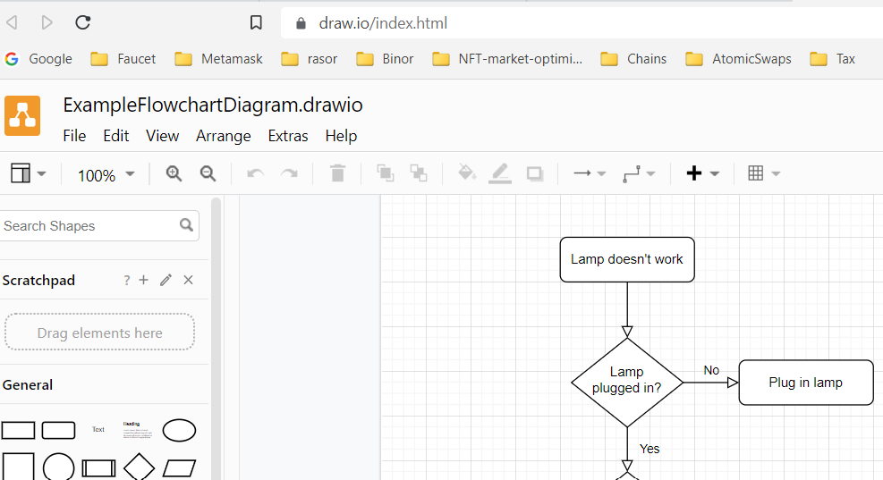
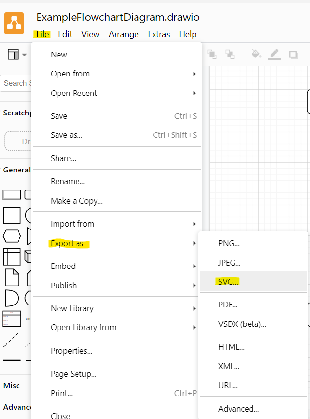
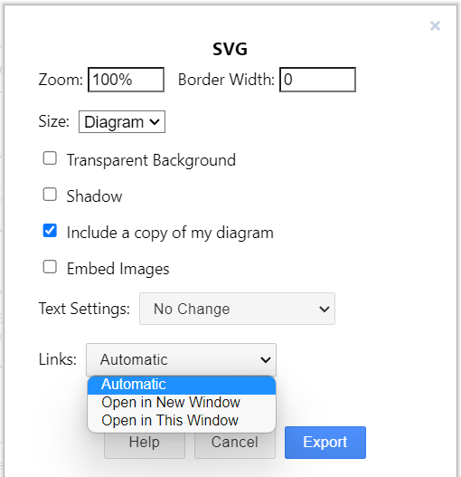
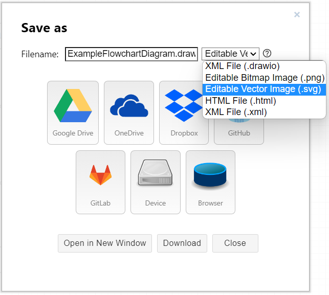
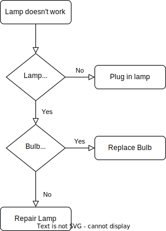

### Intro

I want to add flowchart diagrams to my Gatsby blog as SVG files.  
There are two tools I currently like
1. [draw.io](#using-drawio)
2. [flowchart.js](#using-flowchartjs)

**draw.io** is nice when you want to have a graphical UI for drawing your SVG images.  
Easy to change **layout** but harder to change **flow**.  

**flowchart.js** is nice when you want to have a React component as the canvas for your flow, which is just a string input for your component.  
In other words - your flowchart is just some text.  
Easy to change **flow** but harder to change **layout**.  

### Using [draw.io](https://drawio-app.com)

There are several editors for draw.io - see [links](#links) below.  
So choose an editor, draw you diagram and export as SVG.  
Here I am using the [online editor](https://www.draw.io/index.html)  

_Diagram created using online editor_

You can Export as SVG



Or you can just Save as SVG


After saving as SVG, then the online editor continues editing in the SVG file (opposed to the .drawio file), which is nice, since for this usage, I am only interested in the SVG source.  

Having created an image I want to use it in Gatsby.  
You can just save the SVG into your folder containing this `index.md` and use it like any other image:
```md

```


### Using [flowchart.js](https://flowchart.js.org)

ToBeAdded

### Links

* draw.io - now digrams.net
    * Editors
        * [Online Editor](https://app.diagrams.net/)
        * [Desktop (Offline) Editor](https://github.com/jgraph/drawio-desktop/releases/)
        * [Google Docs Editor](https://drawio-app.com/use-draw-io-diagrams-in-google-docs/)
        * [Use draw.io Offline](https://drawio-app.com/use-draw-io-offline/)
    * Draw
        * [Examples](https://drawio-app.com/examples/)
        * [Cheat sheets for beginners](https://drawio-app.com/draw-io-diagramming-in-confluence-cheat-sheets-for-beginners/)
        * [Video Tutorials](https://drawio-app.com/tutorials/video-tutorials/)
        * draw.io on [youtube](https://www.youtube.com/channel/UCiTtRN9b8P4CoSfpkfgEJHA)
    * Export
        * [Which format should I export a diagram to?](https://drawio-app.com/choose-export-diagram-format/)
    * Import: Use SVG in web
        * [Embed your diagram as an SVG in a web page](https://www.diagrams.net/doc/faq/embed-svg)
        * [How to Add SVG Images in React](https://dev.to/mohammedasker/how-to-add-svg-images-in-react-1h2g)
* flowchart.js - Draws simple SVG flow chart diagrams from textual representation of the diagram
    * Home of [flowchart.js](https://flowchart.js.org/?lng=en)
    * Using [flowchart.js: ](https://github.com/adrai/flowchart.js)
    * CLI for [flowchart.js](https://github.com/seflless/diagrams#flowchart)
    * React.js flowchart component based on [flowchart.js](https://github.com/alwinn1977/react-simple-flowchart)
* [A few other Diagram tools for React](https://stackoverflow.com/a/58892033)

...
