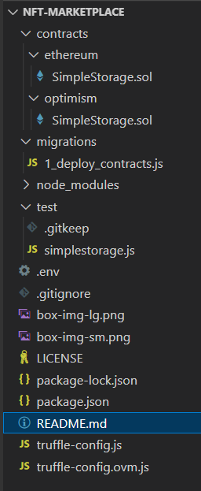

## Intro

This is my replay of the blog [How to Build a NFT Marketplace DApp on Ethereum and Optimism](https://trufflesuite.com/guides/nft-marketplace/) / [vlog](https://youtu.be/Ie1o34Xh1I4)  
by [@_emjlin](https://twitter.com/_emjlin).  

[Code](https://github.com/truffle-box/nft-marketplace-box) for her project.  

### Glossary

This glossary links to networks you would want to connect to

* `EVM` - Ethereum Virtual Machine: A Execution engine that can execute smart contracts on a blockchain
* `Ethereum`: The `L1` blockchain running `EVM` smart contracts
* `NFT`: A unique item on a blockchain enabled via `EVM` contracts
* `L2`: A faster and cheaper network than the L1 (Ethereum) network on top of the `L1` network
* `Optimism`: An Ethereum `L2` technologi and `test network`
    * [Public RPC Endpoints](https://community.optimism.io/docs/useful-tools/networks/#rpc-endpoints)
* `Infura`: A `production network` supporting `Optimism` 
    * [Choose a network - Infura](https://docs.infura.io/infura/networks/optimism/how-to/choose-a-network)
* `Optimism Goerli`: New test network
    * [wip](https://community.optimism.io/docs/useful-tools/networks/#optimism-goerli)
* `Optimism Kovan`: Old test network
    * [ended august 15th 2022](https://community.optimism.io/docs/useful-tools/networks/#optimism-kovan-old-testnet)
* `Faucet`: Supplier of test ETH to pay for transactions on test networks
    * [Paradigm MultiFaucet](https://faucet.paradigm.xyz)
* `Local development node`: 
    * [Running a local development environment](https://community.optimism.io/docs/developers/build/dev-node/)
    * [optimism-tutorial/getting-started at main · ethereum-optimism/optimism-tutorial](https://github.com/ethereum-optimism/optimism-tutorial/tree/main/getting-started#optimism-endpoint-url)
* `WSL2` Windows Subsystem for Linux: A virtual machine host on Windows (Home)
* `Docker`: A `local virtual machine manager` you can use for hosting `local development node(s)`. On windows Home it will run in `WSL2`

## Install

We need an editor, docker ([for optimism box](https://github.com/truffle-box/optimism-box#requirements)) and some web3 tools:

* Editor:
    * VSCode
* docker, version 19.03.12 or later (`docker -v`)
* docker-compose, version 1.27.3 or later (`docker-compose -v`)
* Web3 Tools:
    * [Truffle 4 VSCode Extension](./truffle-vscode-extension)
* Web3 Wallet: 
    * [MetaMask](https://metamask.io/download/) - choose browser extension

## Development Procedure

Note: You need your Infura or Alchemy project Id for `INFURA_KEY` in file `.env` 

Note: You need your wallet Mnemonic `GOERLI_MNEMONIC` in file `.env` 


### Scaffold your project

In truffle scaffolding/unpacking files are called unboxing.  
For Optimism, there is a pre-defined package you can use:  

```bash
# In bash:
cd <your project-parent-dir>
truffle unbox optimism nft-marketplace
# Unbox successful, sweet!
# Commands:
#   compile: truffle compile
#   migrate: truffle migrate
#   test:    truffle test

# open project in vscode
cd nft-marketplace
code .
```

_[Files](https://github.com/truffle-box/optimism-box) after `truffle unbox optimism`_

### Examining the package

Notice - in `package.json` you find these npm stripts:
```json
  // package.json
  "scripts": {
    "installLocalOptimism": "git clone git@github.com:ethereum-optimism/optimism.git && cd optimism/ops && docker-compose pull",
    "startLocalOptimism": "cd optimism/ops && docker-compose up",
    "stopLocalOptimism": "cd optimism/ops && docker-compose down -v",
    "checkLocalOptimismReady": "cd optimism/ops && scripts/wait-for-sequencer.sh && echo 'System is ready to accept transactions'",
    "compile:evm": "truffle compile",
    "compile:ovm": "truffle compile --config truffle-config.ovm.js",
    "migrate:evm": "truffle migrate",
    "migrate:ovm": "truffle migrate --skip-dry-run --config truffle-config.ovm.js --network $npm_config_network",
    "test:evm": "truffle test",
    "test:ovm": "truffle test --config truffle-config.ovm.js --network $npm_config_network",
    "exec:evm": "truffle exec",
    "exec:ovm": "truffle exec $script --config truffle-config.ovm.js --network $npm_config_network"
  },
```

You see there are 

* `:evm` scripts for running towards `L1 Etherium` and
* `:ovm` scripts for running towards `L2 Optimism`

You see local optimism uses `docker-compose`.  

So what did Emily add?

Now I'll delete the truffle box and install her box

```bash
# In bash:
cd <your project-parent-dir>
rmdir nft-marketplace
truffle unbox nft-marketplace-box nft-marketplace
# open project in vscode
cd nft-marketplace
code .
```

You find the diff in [this commit](https://github.com/binordev/nft-marketplace/commit/191f7a8442d915b073c9b3d8fcab96e44fb67de8)

She added:

* a [next.js webapp](https://github.com/binordev/nft-marketplace/commit/191f7a8442d915b073c9b3d8fcab96e44fb67de8#diff-c4577d0b3a9c55c4e75639bb45f3dd659e83bc31b7a30943fda6ef84f7cef47a)
    * using [tailwind css](https://github.com/binordev/nft-marketplace/commit/191f7a8442d915b073c9b3d8fcab96e44fb67de8#diff-e048fb8380f32b06b874b12ef1f5e1a69acf2f0bbe88b98fe0c91c98ff884952)
* marketplace and nft [smart contracts](https://github.com/binordev/nft-marketplace/commit/191f7a8442d915b073c9b3d8fcab96e44fb67de8#diff-1d4e45b08f1c079108225dc54d333cb784612fdd1d1402fa482a8d55a83bbae0), both for ethereum and optimism
* [deploye script](https://github.com/binordev/nft-marketplace/commit/191f7a8442d915b073c9b3d8fcab96e44fb67de8#diff-5719596698146086876ac469ae9de9400d4956c9c94822d968233c3523306415) for contracts
* she uses kovan instead of goerli [test network](https://github.com/binordev/nft-marketplace/commit/191f7a8442d915b073c9b3d8fcab96e44fb67de8#diff-8f7ceaa83eaf3c53b82b8dc646e61e0d66a865cec9da0baa4c19b9833baacd0f)

Emilys code is inspired by [@dabit3](https://twitter.com/dabit3)'s [code](https://github.com/dabit3/polygon-ethereum-nextjs-marketplace/). As Emily her wrote a [blog](https://dev.to/edge-and-node/building-scalable-full-stack-apps-on-ethereum-with-polygon-2cfb) and recorded a [vid](https://www.youtube.com/watch?v=GKJBEEXUha0).  
Opposed to Emily, @dabit3 deploys to Polygon (not Optimism), develops in Hardhat (not Truffle) and uses [ethers](https://www.npmjs.com/package/ethers) (not [web3](https://www.npmjs.com/package/web3)) for Ethereum JS API.  

## Links

* Tools and Docs:
    * Quickstart: [Truffle 4 VSCode](https://trufflesuite.com/docs/vscode-ext/quickstart/)
    * Blog: [Web3 with the Truffle 4 VSCode extension](https://trufflesuite.com/blog/build-on-web3-with-truffle-vs-code-extension/)
    * Blog: [Getting Started With Infura](https://blog.infura.io/post/getting-started-with-infura-28e41844cc89)
    * Docs: [Optimism Developer docs](https://community.optimism.io/docs/developers/)
    * Fauset: [Paradigm MultiFaucet](https://faucet.paradigm.xyz)
    * Connect your wallet to EVM chains via [Chainlist](https://chainlist.org/)
* Boilerplates: 
    * Optimism box: [Truffle box with code to start working with Optimism L2](https://github.com/truffle-box/optimism-box)
    * @_emjlin's [nft-marketplace-box](https://github.com/truffle-box/nft-marketplace-box)
* Social:
    * [@_emjlin on github](https://github.com/emilyJLin95)
    * [@trufflesuite](https://twitter.com/trufflesuite)
    * Support: [ConsenSys on Discord](https://discord.com/invite/QZzArGyKVT)

## Other related links

* [Differences between Ethereum and Optimism](https://community.optimism.io/docs/developers/build/differences/#)
* Docs: [Truffle Suite](https://trufflesuite.com/docs/)
* [Solidity documentation](https://docs.soliditylang.org/en/latest/)
* https://github.com/truffle-box/nft-box
* https://github.com/truffle-box/truffle-creator-box
* https://github.com/truffle-box/azure-simple-marketplace-box
* https://github.com/ysharad/nft-marketplace
* https://dev.to/edge-and-node/building-scalable-full-stack-apps-on-ethereum-with-polygon-2cfb

...
