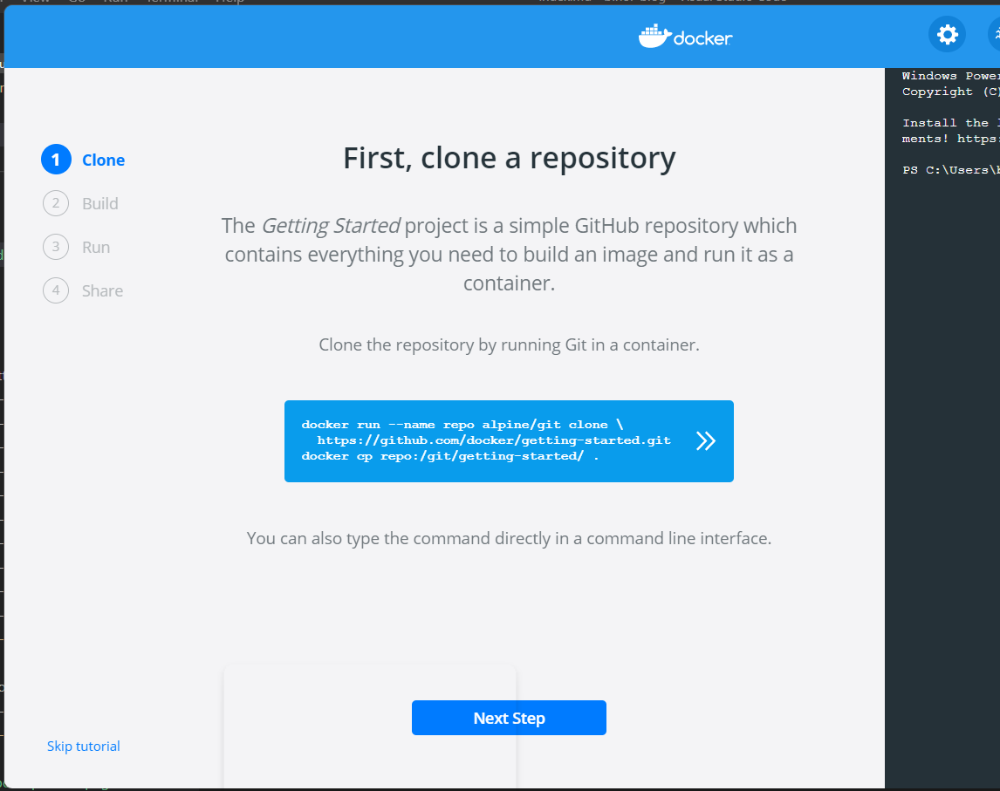

## Intro

In Docker Desktop there is a tutorial.

I´ve pasted the content into here for a quick reference.  


_Image from Docker Desktop_

## 1. First, clone a repository

The _Getting Started_ project is a simple GitHub repository which contains everything you need to build an image and run it as a container.

Clone the repository by running Git in a container.

```
docker run --name repo alpine/git clone \
https://github.com/docker/getting-started.git
docker cp repo:/git/getting-started/ .
```

## Links

* [get-started](https://docs.docker.com/get-started/)

...