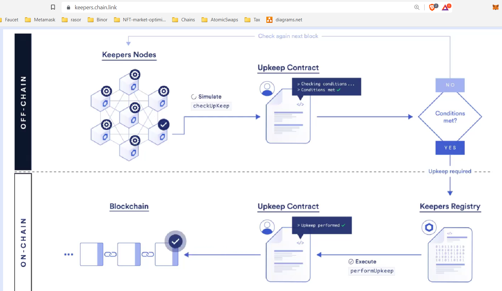

### Intro

### Links

* ChainLink:
    * UseCases - [77+ Smart Contract Use Cases Enabled by Chainlink | Chainlink Blog](https://blog.chain.link/smart-contract-use-cases/)
    * [Hackathon Resources | Chainlink Documentation](https://docs.chain.link/docs/hackathon-resources/)
        * [Building External Adapters | Chainlink Documentation](https://docs.chain.link/docs/developers/)
* Price feed
    * [HOW TO GET CRYPTO PRICES INSIDE SMART CONTRACTS USING CHAINLINK ORACLES](https://www.youtube.com/watch?v=Qy8qBOuZ5pE)
    * [Using Data Feeds | Chainlink Documentation](https://docs.chain.link/docs/get-the-latest-price/)
    * [Ethereum Data Feeds | Chainlink Documentation](https://docs.chain.link/docs/ethereum-addresses/)
* Keepers:
    * [Automate Smart Contract Functions | Chainlink Keeper Network](https://keepers.chain.link/)
        * Intro - [Introduction to Chainlink Keepers | Chainlink Documentation](https://docs.chain.link/docs/chainlink-keepers/introduction/)
        * Register a time-based Upkeep - [Chainlink Keepers Job Scheduler | Chainlink Documentation](https://docs.chain.link/docs/chainlink-keepers/job-scheduler/)
        * Custom logic - [Creating Keepers-compatible contracts | Chainlink Documentation](https://docs.chain.link/docs/chainlink-keepers/compatible-contracts/)
            * [Chainlink Keepers Example Contracts | Chainlink Documentation](https://docs.chain.link/docs/chainlink-keepers/util-overview/)
            * Vid: [How To Create Dynamic NFTs Using Chainlink Keepers | Chainlink Engineering Tutorials](https://www.youtube.com/watch?v=E7Rm1LUKhj4)
    * Guide -[Registering an Upkeep on Chainlink Keepers - OpenZeppelin Docs](https://docs.openzeppelin.com/defender/guide-chainlink)
    * Intro vid - [Chainlink Keepers Is Now Live on Mainnet](https://blog.chain.link/chainlink-keepers-is-now-live-on-mainnet/)
* LINK on many chains -[LINK Token Contracts | Chainlink Documentation](https://docs.chain.link/docs/link-token-contracts/)
* NFT Metadata:
    * [Metadata Standards](https://docs.opensea.io/docs/metadata-standards)
    * [chainlink-keepers-templates/batch-nft-reveal at main · hackbg/chainlink-keepers-templates](https://github.com/hackbg/chainlink-keepers-templates/tree/main/batch-nft-reveal#metadata)
        * on-chain generated SVG art - [chainlink-fullstack/RandomSVG.sol at main · hackbg/chainlink-fullstack](https://github.com/hackbg/chainlink-fullstack/blob/main/packages/hardhat/contracts/RandomSVG.sol)
            * [A Guide to Designing Effective NFT Launches - Paradigm](https://www.paradigm.xyz/2021/10/a-guide-to-designing-effective-nft-launches)
    * [EIPs/eip-721.md at master · ethereum/EIPs](https://github.com/ethereum/EIPs/blob/master/EIPS/eip-721.md)
    * [EIPs/eip-1155.md at master · ethereum/EIPs](https://github.com/ethereum/EIPs/blob/master/EIPS/eip-1155.md#erc-1155-metadata-uri-json-schema)
* V2 jobs
    * [v2 Jobs | Chainlink Documentation](https://docs.chain.link/docs/jobs/)
        1. cron
            * Executes a job on a schedule. Does not rely on any kind of external trigger.
        2. directrequest
            * Executes a job upon receipt of an explicit request made by a user. The request is detected via a log emitted by an Oracle or Operator contract. This is similar to the legacy ethlog/runlog style of jobs.
            * In the case of a Request and Receive job, the Direct Request job monitors the blockchain for a request from a smart contract.
        3. fluxmonitor
            * The Flux Monitor job type is for continually-updating data feeds that aggregate responses from multiple oracles.
        4. keeper
            * Keeper jobs occasionally poll a smart contract method that expresses whether something in the contract is ready for some on-chain action to be performed. When it's ready, the job executes that on-chain action.
        5. offchainreporting
            * OCR jobs (off-chain reporting jobs) are used very similarly to Flux Monitor jobs. They update data feeds with aggregated data from many Chainlink oracle nodes. However, they do this aggregation using a cryptographically-secure off-chain protocol.
        6. webhook
            * Webhook jobs can be initiated by HTTP request, either by a user or external initiator.
            * The easiest way to test if your external adapter is working is to use a Webhook Job.
                * [Testing External Adapters and Bridges](https://docs.chain.link/docs/node-operators/#testing-external-adapters-and-bridges)
* V1 jobs
* [Migrating to v2 Jobs | Chainlink Documentation](https://docs.chain.link/docs/jobs/migration-v1-v2/)
* API Calls
    * [Introduction to Using Any API | Chainlink Documentation](https://docs.chain.link/docs/request-and-receive-data/)
        * [Make a GET Request | Chainlink Documentation](https://docs.chain.link/docs/make-a-http-get-request/)
    * [External Adapters Introduction | Chainlink Documentation](https://docs.chain.link/docs/external-adapters/)
        * [Building and using External Adapters](https://blog.chain.link/build-and-use-external-adapters/)
        * [Bridges: Adding External Adapters to Nodes | Chainlink Documentation](https://docs.chain.link/docs/node-operators/)
    * [API Calls: Using Any API | Chainlink Documentation](https://docs.chain.link/docs/advanced-tutorial/)
    * [External Adapters in Solidity | Chainlink Documentation](https://docs.chain.link/docs/contract-creators/)
    * Vid: [Chainlink API Call [See Description] | Chainlink Engineering Tutorials](https://www.youtube.com/watch?v=ay4rXZhAefs&list=PLVP9aGDn-X0SPHromvpiGvoNDpH7YErmf&index=13)
    * Vid: [Ultimate Customization with External Adapters | Chainlink Hackathon Workshop](https://www.youtube.com/watch?v=4i75Dqbhjvw&list=PLVP9aGDn-X0SPHromvpiGvoNDpH7YErmf&index=29)
    * Vid: [Building a Chainlink External Adapter Technical Workshop](https://www.youtube.com/watch?v=N8a0590QD74&list=PLVP9aGDn-X0SPHromvpiGvoNDpH7YErmf&index=26)
    * Vid: [Building and Using External Adapters | Chainlink Engineering Tutorials](https://www.youtube.com/watch?v=65NhO5xxSZc&list=PLVP9aGDn-X0QwJVbQvuKr-zrh2_DV5M6J&index=42)
    * Vid: [[See Description] Connect any API to your smart contract | Chainlink Engineering Tutorials](https://www.youtube.com/watch?v=AtHp7me2Yks)
    * Vid: [[Workshop] Customizing APIs with External Adapters: Chainlink Hackathon Workshop](https://www.youtube.com/watch?v=sT3RWq3PkEc&list=PLVP9aGDn-X0SPHromvpiGvoNDpH7YErmf&index=45)
* [Chainlink Nodes | Chainlink Documentation](https://docs.chain.link/chainlink-nodes/)
    * Set Up a Chainlink Node
    * Fulfill Your First Job Request
    * Add External Adapters to Your Node
* Vids:
    * [Chainlink Engineering Tutorials](https://www.youtube.com/playlist?list=PLVP9aGDn-X0QwJVbQvuKr-zrh2_DV5M6J)
        * [Building in DeFi With Aave | freeCodeCamp — Lesson #10](https://www.youtube.com/watch?v=vgOnZkjifAs&list=PLVP9aGDn-X0QwJVbQvuKr-zrh2_DV5M6J&index=13)
        * [Moving Chainlink Cross-Chains | Chainlink Engineering Tutorials](https://www.youtube.com/watch?v=WKvIGkBWRUA&list=PLVP9aGDn-X0QwJVbQvuKr-zrh2_DV5M6J&index=33)
    * [Chainlink Developer Workshops](https://www.youtube.com/playlist?list=PLVP9aGDn-X0SPHromvpiGvoNDpH7YErmf)
        * [Aave 101 for Devs](https://www.youtube.com/watch?v=pzVo1m_DK80&list=PLVP9aGDn-X0SPHromvpiGvoNDpH7YErmf&index=47)
        * [[Workshop] Introduction to Chainlink: Connecting external data to your smart contracts](https://www.youtube.com/watch?v=WGkpEBKytcI&list=PLVP9aGDn-X0SPHromvpiGvoNDpH7YErmf&index=22)
        * [[Workshop] Make a DeFi app, with Chainlink](https://www.youtube.com/watch?v=JEQTcC5vRiI&list=PLVP9aGDn-X0SPHromvpiGvoNDpH7YErmf&index=25)
        * [[Workshop] Indexing and Querying with The Graph](https://www.youtube.com/watch?v=KuB3CjknkX8&list=PLVP9aGDn-X0SPHromvpiGvoNDpH7YErmf&index=37)
        * [Chainlink Local Development Workshop](https://www.youtube.com/watch?v=ugRVBxA_FkE&list=PLVP9aGDn-X0SPHromvpiGvoNDpH7YErmf&index=40)
        * [[Workshop] Loopring 3.6 zkRollup AMM](https://www.youtube.com/watch?v=42XXeAiwdlk&list=PLVP9aGDn-X0SPHromvpiGvoNDpH7YErmf&index=41)
        * [[Workshop] Automate Compound, Uniswap etc. with Gelato](https://www.youtube.com/watch?v=D5SyFrhg1E4&list=PLVP9aGDn-X0SPHromvpiGvoNDpH7YErmf&index=50)
        * [[Workshop] How to turn your hack into a successful business](https://www.youtube.com/watch?v=uaj4uKDWL_I&list=PLVP9aGDn-X0SPHromvpiGvoNDpH7YErmf&index=58)
        * [[Workshop] Your dApp isn&#39;t finished without ENS](https://www.youtube.com/watch?v=6wd3MN2wAfU&list=PLVP9aGDn-X0SPHromvpiGvoNDpH7YErmf&index=56)
        * [Developing with Chainlink Decentralized Oracles: Unitize2020 Hackathon Presentation](https://www.youtube.com/watch?v=wmALQok_WFg&list=PLVP9aGDn-X0SPHromvpiGvoNDpH7YErmf&index=10)
 * [Learning Resources | Chainlink Documentation](https://docs.chain.link/docs/other-tutorials/)
    * API Requests
        * Build a Real Estate dApp With Chainlink Oracles	Real-Estate	Medium
        * Off-Chain Computation: Statistical Analysis With Chainlink	Statistical Analysis	Advanced
        * Blockchain Fintech Tutorial: Lending and Borrowing With Python	Lending	Medium
        * Build a Blockchain-Based Fantasy Sports Game Using a Chainlink External Adapter	Sports	Medium
        * Fetch IPFS Data in Smart Contracts Using a Chainlink External Adapter	Audius	Medium
        * How to Connect a Two-Factor Authentication (2FA) API to a Smart Contract With Chainlink	Security	Medium
        * Build a Marine Insurance Smart Contract With Chainlink	Insurance	Medium
        * How to Build a Parametric Insurance Smart Contract	Insurance	Advanced
        * Connect a Smart Contract to the Twitter API	Social Media	Advanced
        * Build an RFID Blockchain Integration With Chainlink External Adapters	Identification	Advanced
        * How to Connect a Tesla Vehicle API to a Smart Contract Via a Chainlink External Adapter	Transportation	Advanced
        * OAuth and API Authentication in Smart Contracts	Security	Advanced   

...
